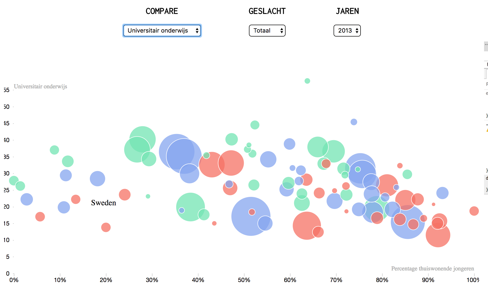

# Young Europeans living with their parents

## ***Short description***
As part of Project Information Design, I made this interactive data visualisation about young Europeans living with their parents and their education, poverty, life expectancy and employment rates.

https://projects.invisionapp.com/m/share/36EEBGKVN#/263047567

_As this was a school assignment of Hogeschool van Amsterdam, the following info will be in dutch._

## Beschrijving 

Bij het zoeken naar data ben ik om inspiratie op te doen naar nieuwsartikelen gaan zoeken die ik interessant vond. Een trend in artikelen is het onderwerp millennials. Volgens wikipedia is de definitie van een millennial iemand die tussen 1980 en 2000 is geboren. Bij het zoeken naar datasets kwam ik al snel uit bij het hoofdstuk “Youth” in eurostat. Informatie hierover wordt opgedeeld in populatie, educatie, gezondheid, arbeid, jongeren in de digitale wereld en enkele andere onderwerpen. Onder het kopje “population” is een dataset te vinden over het aantal jongeren dat bij hun ouders woont. Dit onderwerp heb ik al vaker voorbij zien komen bij het zoeken naar inspiratie op sites zoals reddit.com/r/dataisbeautiful en informationisbeautiful.net. 

### Het onderzoek

#### Thuiswonend
Het aantal jongeren dat thuiswonend is zegt veel over deze generatie. Veel krantenartikelen spreken hier al over. Zo schijnt dit te maken te hebben met een minder traditionele blik op het gezinsleven, de drang om te reizen en het feit dat veel jongeren gaan reizen. Ook is het schoolsysteem, de huizenmarkt en arbeidsmarkt de laatste jaren veranderd.

Gemeten | Resultaat
--- | ---
Onderwerp | Percentage van jongeren dat thuis woont
Groep	|	20 - 29 jarigen per Europees land
Variabelen |	Geslacht / Land / Jaartal
Vergeleken met |		Werkgelegenheid, armoede, onderwijs en 							leeftijdsverwachting.

#### Werkgelegenheid 
Het eerste onderwerp dat ik verbind aan het thuis wonen van jongeren is werkgelegenheid. Hiermee kan ik niet alleen de economische situatie van een land begrijpen, maar ook zien hoeveel invloed het hebben van een baan heeft op jongeren. Het hebben van een baan kan duiden op een goede economie waarin studenten/afgestudeerden snel een baan vinden, maar het kan ook betekenen dat jongeren niet kunnen studeren of noodgedwongen een baan zoeken. Dit inzicht is vooral interessant in verband met meerdere factoren, zodat een duidelijker en realistischer beeld wordt gegeven van de situatie.

#### Levensverwachting 

Het tweede onderwerp waarnaar ik heb gezocht is gezondheid. Dit heb ik gemeten met de leeftijdsverwachting van een land. Welzijn is moeilijk te meten, maar op deze manier kan de gebruiker toch een beeld krijgen van de gezondheid van de onderzochte groep mensen. De leeftijdsverwachting is niet gebaseerd op de leeftijdsgroep, maar op hoe oud de gemiddelde mens wordt, die in het jaar van meting geboren is. Dus in 2007 is de leeftijdsverwachting die van baby’s < 1 jaar.

Gemeten | Resultaat
--- | ---
Onderwerp | Gemiddelde levensverwachting
Groep	|	De volledige bevolking
Variabelen |	Geslacht / Land / Jaartal
Vergeleken met | Thuiswonende jongeren

#### Welvaart

Het derde onderwerp is armoede. Dit verdeel ik onder in dezelfde groep jongeren (20 tot 29), in een groep die grotendeels de ouders representeren van de groep jongeren (50 too 64) en een groep van 65-plus, om te laten zien wat het verschil is met de oudste groep.

Gemeten | Resultaat
--- | ---
Onderwerp | Percentage van de bevolking dat rond de armoedegrens leeft
Groep	|	20-29 jaar / 50-64 jaar / 65-plus / totaal
Variabelen |	Geslacht / Land / Jaartal
Vergeleken met | Thuiswonende jongeren

#### Educatie
De laatste dataset die ik gebruikt heb is educatie. Omdat elk Europees land een ander systeem en dus een ander niveau hanteert, heeft Eurostat eigen richtlijnen opgesteld zodat deze niveaus te vergelijken zijn. Hierbij heb ik de dataset geselecteerd op het hoogste niveau, in Nederland is dit vergelijkbaar met een HBO-Master of een WO-Bachelor en hoger.

Gemeten | Resultaat
--- | ---
Onderwerp | Percentage jongeren dat minstens niveau 3 studeert
Groep	|	20-29 jarigen 
Variabelen |	Geslacht / Land / Jaartal
Vergeleken met | Thuiswonende jongeren